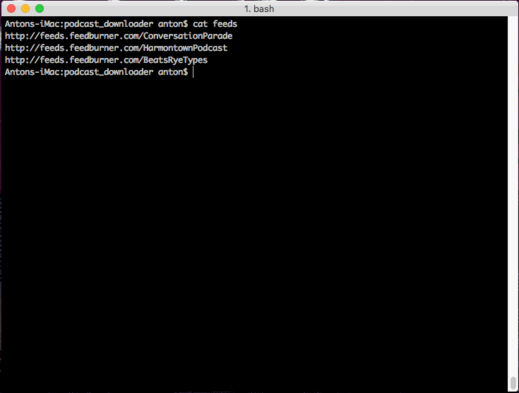

# PodcastDownloader

I wanted something which could download all episodes of my favorite podcasts for archiving purposes - so I made this thing. You give it a list of feeds, it will download the podcasts along with the descriptions. You can run it periodically to get the new episodes.

## Installation

(Clone this repo. Install Elixir.)

Get required depdencies the first time:

`mix deps.get`

Run:

`mix run -e "PodcastDownloader.run"`

Or if you want to specify `feeds` file and `downloads` folder:

`mix run -e "PodcastDownloader.run('feeds', 'downloads')"`